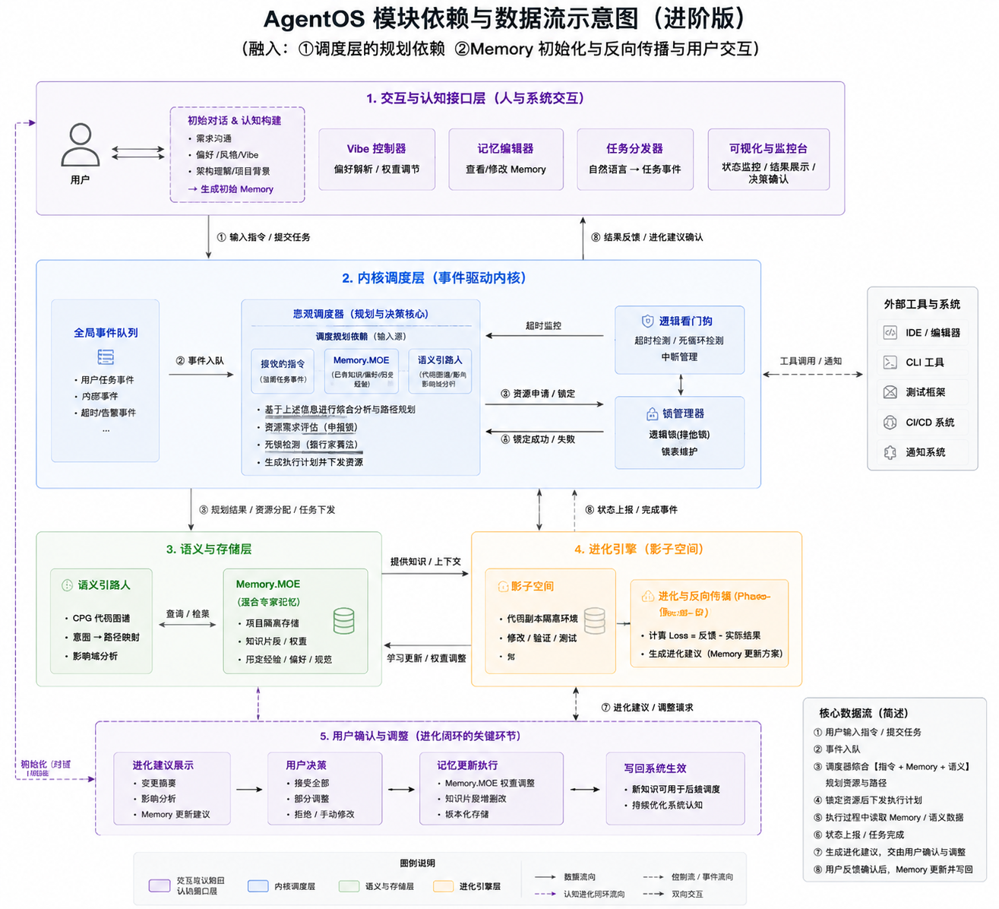

<div align="center">

# VibeOS

**面向 AI 编码代理的事件驱动操作系统内核**

编排 Claude / Codex / Gemini 等 CLI 工具,提供调度、Memory MOE、影子空间进化与用户反馈闭环的完整能力。

[](https://golang.org)
[](#-阶段进度)
[](docs/design/architecture.md)
[](#-构建与测试)
[](#)

[快速开始](#-快速开始) · [架构总览](#-架构总览) · [模块矩阵](#-模块矩阵) · [Dashboard API](#dashboard-api) · [设计文档](docs/design/architecture.md)

</div>

---

## 目录

- [项目简介](#-项目简介)
- [核心特性](#-核心特性)
- [架构总览](#-架构总览)
- [阶段进度](#-阶段进度)
- [模块矩阵](#-模块矩阵)
- [快速开始](#-快速开始)
- [使用方式](#-使用方式)
  - [作为库嵌入](#作为库嵌入)
  - [作为 WebSocket 服务器](#作为-websocket-服务器)
  - [作为 CLI 守护进程](#作为-cli-守护进程)
  - [Dashboard 控制面](#dashboard-控制面)
- [构建与测试](#-构建与测试)
- [配置](#-配置)
- [关键设计决策](#-关键设计决策)
- [仓库结构](#-仓库结构)
- [贡献](#-贡献)
- [鸣谢](#-鸣谢)

---

## 🚀 项目简介

VibeOS 把"AI 编码代理"看作一台操作系统来构建,而不是一段调用 LLM 的应用代码。
它在 Claude / Codex / Gemini 这类 CLI 工具之上,补齐了 Agent 长期协作所需要的全部基础设施:

- **调度内核**:全局事件总线 + 意图调度器 + 进程看门人 + 锁管理器,统一治理并发与超时;
- **记忆系统**:Type × Domain 的 MOE 路由 + SQLite 存储,跨会话沉淀经验;
- **语义层**:Tree-sitter / SCIP / Joern 分层的代码理解栈(接口齐备,后端可热插);
- **进化引擎**:基于 `git worktree` 的影子空间,把试错与正式工作树物理隔离;
- **反馈闭环**:把"评估—提案—用户裁定—写回 Memory"做成一等公民流程。

两种部署入口:**移动端 WebSocket 服务器**,以及**桌面 CLI 守护进程**。

---

## ✨ 核心特性

| | |
|---|---|
| 🧠 **认知架构落地** | 5 层 + 双主线设计,P0–P5 全部就绪;P1–P5 联调测试覆盖。 |
| 📡 **统一事件总线** | 来源分类(user / session / kernel / external)的全局总线,Dashboard SSE 直连。 |
| 🧮 **Memory MOE** | (短/长/项目) × (代码/对话/任务) 二维路由,SQLite + sqlite-vec 存储。 |
| 🔬 **代码语义分层** | Chunker / Embedder / SymbolIndex / FlowAnalyzer 接口齐全,Tree-sitter / SCIP / Joern 可逐步落地。 |
| 🪞 **影子空间隔离** | `git worktree` + 能力白名单;<100ms 创建、跨平台、零容器开销。 |
| 🔄 **用户反馈闭环** | Propose → Accept / Reject / Adjust → 自动写回 Memory(置信度可调)。 |
| 🎛 **Dashboard 控制面** | 事件 SSE + 会话视图 + 记忆 CRUD + 调度决策 + 反馈 API,内嵌 HTML。 |
| 📱 **移动 / 桌面双入口** | WebSocket gateway(移动端)+ agentd 守护进程(桌面 CLI)。 |
| 🛠 **AI CLI 抽象** | 统一封装 Claude / Codex / Gemini 的 PTY / Exec 运行器,事件归一化。 |

---

## 🏛 架构总览

<div align="center">
  
  <br/>
  <sub>VibeOS 模块依赖与数据流示意图(进阶版)。<a href="docs/design/architecture.md">查看详细说明 →</a></sub>
</div>

文字版分层:

```
┌─ 1. 交互与认知接口层 ──────────────────────────────────────┐
│   intake · vibe · dashboard(记忆编辑器 / 任务分发器)       │
├─ 2. 内核调度层(事件驱动)─────────────────────────────────┤
│   eventbus(全局事件队列)                                  │
│   kernel/scheduler · kernel/watchdog · kernel/lockmgr      │
├─ 3. 语义与存储层 ──────────────────────────────────────────┤
│   semantic(Chunker / Embedder / SymbolIndex / FlowAnalyzer)│
│   memory + memory/moe(Type × Domain 专家路由)             │
├─ 4. 进化引擎(影子空间)──────────────────────────────────┤
│   shadow(git worktree 隔离) · evolve                      │
├─ 5. 用户反馈闭环 ──────────────────────────────────────────┤
│   feedback(提案 · 接受 / 拒绝 / 调整 · 写回)              │
└────────────────────────────────────────────────────────────┘
        ▲                                                  ▲
        │ 行为原语(session)                               │ 线协议(protocol)
        │ 运行器(engine:PTY / Exec)                      │ 持久化(data)
        │ 传输层(gateway WS + cmd/* daemons)              │
```

---

## 📊 阶段进度

| 阶段 | 范围 | 关键包 | 状态 |
|---|---|---|---|
| **P0** | 全局事件总线 | `internal/eventbus` | ✅ |
| **P1** | 调度三件套 | `internal/kernel/{scheduler,watchdog,lockmgr}` | ✅ |
| **P2** | Memory + MOE + 语义嵌入器 | `internal/memory`、`internal/memory/moe`、`internal/semantic` | ✅ 骨架就绪 · ⏳ Tree-sitter / SCIP / Joern 真实后端待接 |
| **P3** | 交互与认知接口层 | `internal/intake`、`internal/vibe`、`internal/dashboard` | ✅ |
| **P4** | 影子空间 + 进化引擎 | `internal/shadow`、`internal/evolve` | ✅ |
| **P5** | 反馈闭环 | `internal/feedback` | ✅ |

> P1–P5 端到端联调测试见 [`internal/kernel/p1_integration_test.go`](internal/kernel/p1_integration_test.go)。

---

## 🧩 模块矩阵

| 包 | 职责 | 关键类型 |
|---|---|---|
| `internal/kernel` | 编排核心,把所有子系统 wire 在一起 | `Kernel`、`RuntimeSession`、`RuntimeSessionRegistry` |
| `internal/kernel/scheduler` | 意图调度器(准入 / 延后 / 冲突) | `Scheduler`、`IntentRequest`、`Decision` |
| `internal/kernel/watchdog` | 单次执行的空闲 / 超时守护 | `Watchdog`、`WatchOptions` |
| `internal/kernel/lockmgr` | 单会话独占锁,超时强制释放 | `Manager`、`Lock` |
| `internal/eventbus` | 全局事件总线(SourceUser / Session / Kernel / External) | `Bus`、`Envelope`、`Subscription` |
| `internal/memory` | Memory 实体与存储抽象 | `Entry`、`Filter`、`Store`、`MemStore`、`SQLiteStore` |
| `internal/memory/moe` | (Type × Domain) 二维 MOE 路由 | `Router` |
| `internal/semantic` | 代码语义分层栈 | `Chunker`、`Embedder`、`SymbolIndex`、`FlowAnalyzer`、`Service` |
| `internal/intake` | 会话级认知构建 | `SessionIntake`、`CognitiveProfile`、`ProjectHint` |
| `internal/vibe` | 偏好控制器(style / proactivity / role) | `Controller`、`State` |
| `internal/dashboard` | HTTP 观测 + 控制面 | `Handler` |
| `internal/shadow` | git worktree 隔离工作区 | `Manager`、`Workspace` |
| `internal/evolve` | 影子空间下的评估器与学习提炼 | `Evolver`、`Proposal`、`Result` |
| `internal/feedback` | 用户裁定反馈闭环 | `Controller`、`Suggestion`、`Record` |
| `internal/session` | AI agent 行为原语 | `Service`、`ExecuteRequest`、`Snapshot` |
| `internal/engine` | PTY / Exec 运行器 | `Runner`、`Mode` |
| `internal/protocol` | 40+ 个 session-scoped 事件 + EventCursor | `Event`、`LogEvent`、`PromptRequestEvent`、… |
| `internal/data` | 持久化 + claudesync / codexsync | `Store`、`SessionRecord` |
| `internal/gateway` | WebSocket 传输 + 鉴权 + 推送桥接 | `Handler` |
| `internal/adb` · `push` · `tts` · `config` · `logx` | 周边能力 | — |

---

## 🏁 快速开始

### 前置要求

- Go **1.25+**
- (可选) `claude` / `codex` / `gh` CLI 在 PATH 中 — 仅当你要实际驱动这些 agent 时
- (可选) `git` 2.5+ — `shadow` 模块依赖 `git worktree`

### 30 秒上手

```bash
git clone https://github.com/JayCRL/VibeOS.git
cd VibeOS
go build ./...

# 运行 P1–P5 端到端联调
go test ./internal/kernel/...

# 启动 WebSocket 服务器
AUTH_TOKEN=dev go run ./cmd/mobilevc
```

---

## 📦 使用方式

### 作为库嵌入

```go
import (
    "context"

    "mobilevc/internal/data"
    "mobilevc/internal/engine"
    "mobilevc/internal/kernel"
    "mobilevc/internal/session"
)

func main() {
    store, _ := data.NewFileStore("")
    k := kernel.New(store)
    defer k.Stop()

    summary, _ := store.CreateSession(context.Background(), "demo session")

    svc := session.NewService(summary.ID, session.Dependencies{
        NewExecRunner: k.NewExecRunner,
        NewPtyRunner:  k.NewPtyRunner,
    })

    _ = svc.Execute(context.Background(), summary.ID, session.ExecuteRequest{
        Command: "claude",
        Mode:    engine.ModePTY,
    }, func(event any) {
        // 处理来自 agent 的协议事件
    })
}
```

构造出的 `Kernel` 已经把整套认知栈作为字段暴露:
`Bus`、`Scheduler`、`Watchdog`、`LockMgr`、`MemStore`、`MoeRouter`、`Semantic`、
`Intake`、`Vibe`、`ShadowMgr`、`Evolver`、`Feedback`。按需取用即可。

### 作为 WebSocket 服务器

为移动客户端(iOS / Android)提供长连接通道:

```bash
AUTH_TOKEN=your-secret PORT=8001 go run ./cmd/mobilevc
```

### 作为 CLI 守护进程

在桌面环境下直接驱动 kernel(无 WebSocket 层):

```bash
go run ./cmd/agentd
```

### Dashboard 控制面

把 dashboard handler 与 gateway 共同挂载:

```go
mux := http.NewServeMux()
mux.Handle("/ws", gatewayHandler)
mux.Handle("/dashboard/", dashboard.NewHandler(k.Bus, k.MemStore, k, k.Feedback))
http.ListenAndServe(":8001", mux)
```

#### Dashboard API

| 端点 | 方法 | 用途 |
|---|---|---|
| `/dashboard/` | GET | 内嵌 HTML 控制台 |
| `/dashboard/events` | GET / `?stream=1`(SSE) | 最近事件 / 实时事件流 |
| `/dashboard/sessions` | GET | 活跃会话列表 |
| `/dashboard/memory` | GET / POST | 列出 / 写入 Memory 记录(记忆编辑器) |
| `/dashboard/memory/{id}` | GET / DELETE | 单条读取 / 删除 |
| `/dashboard/decisions` | GET | 最近调度器决策 |
| `/dashboard/console/exec` | POST | 派发一条 AI 指令(任务分发器) |
| `/dashboard/feedback/pending` | GET | 待用户裁定的建议 |
| `/dashboard/feedback/history` | GET | 历史决定 |
| `/dashboard/feedback/stats` | GET | 接受 / 拒绝计数 |
| `/dashboard/feedback/decide` | POST | 接受 / 拒绝 / 调整某条建议 |

---

## 🧪 构建与测试

```bash
# 编译全部包
go build ./...

# 跑全部测试
go test ./...

# 跑 P1–P5 端到端联调
go test ./internal/kernel/...

# 单跑某个子系统
go test ./internal/semantic/
go test ./internal/dashboard/
```

> 注:`internal/gateway` 的 `doctor` 用例与 `internal/engine` 的部分 PTY 用例会真实拉起 `adb` / `zsh` 子进程,在沙箱环境可能 flaky,跟核心架构无关。

---

## ⚙ 配置

通过环境变量配置:

| 变量 | 默认 | 说明 |
|---|---|---|
| `AUTH_TOKEN` | *必填* | WebSocket 鉴权 token(仅 `mobilevc` 需要) |
| `PORT` | `8001` | 监听端口 |
| `RUNTIME_DEFAULT_COMMAND` | `claude` | 默认 AI CLI |
| `RUNTIME_DEFAULT_MODE` | `pty` | 执行模式(`pty` / `exec`) |
| `RUNTIME_DEBUG` | `false` | 调试日志开关 |
| `TTS_ENABLED` | `false` | 启用 ChatTTS 语音 |

---

## 🧭 关键设计决策

详见 [`docs/design/architecture.md`](docs/design/architecture.md):

| 决策 | 选型 | 理由 |
|---|---|---|
| **CPG / 代码语义图** | Tree-sitter 常驻 + SCIP 按需 + Joern 备胎(分层) | 兼顾性能与深度;拒绝 JVM 级常驻 |
| **Memory 存储** | SQLite + sqlite-vec,接口预留 LanceDB | 单机 10w–100w 条目场景够用,零外部进程;明确排除 Chroma / Qdrant |
| **影子空间隔离** | `git worktree` + 能力白名单 | <100ms、跨平台、零容器;危险动作交给 lockmgr + watchdog 兜底 |
| **MOE 专家边界** | 一级按记忆类型 × 二级按领域,规则路由起步 | 预留 `CognitiveKind` 升级位,有数据后训练分类器 |

---

## 🗂 仓库结构

```
.
├── cmd/
│   ├── mobilevc/              # WebSocket 服务器入口
│   └── agentd/                # 桌面 CLI 守护进程入口
├── internal/
│   ├── kernel/                # 编排核心 + scheduler / watchdog / lockmgr
│   ├── eventbus/              # 全局事件总线 [P0]
│   ├── memory/                # Memory 实体 + Store + moe/ 路由 [P2]
│   ├── semantic/              # 代码语义分层栈 [P2]
│   ├── intake/                # 会话级认知构建 [P3]
│   ├── vibe/                  # 偏好控制器 [P3]
│   ├── dashboard/             # HTTP 观测 + 控制面 [P3]
│   ├── shadow/                # git worktree 隔离 [P4]
│   ├── evolve/                # 进化评估器 [P4]
│   ├── feedback/              # 用户反馈闭环 [P5]
│   ├── session/               # AI agent 行为原语
│   ├── engine/                # PTY / Exec 运行器
│   ├── protocol/              # 线协议事件
│   ├── data/                  # 持久化
│   ├── gateway/               # WebSocket / ADB / 推送
│   ├── adb/  push/  tts/      # 周边能力
│   └── config/  logx/         # 配置 + 日志
├── docs/
│   ├── design/
│   │   ├── architecture.md    # 架构单一信源
│   │   └── p0-eventbus.md … p5-feedback.md
│   └── assets/
│       └── architecture.png   # 架构图
├── go.mod
└── README.md
```

---

## 🤝 贡献

欢迎 issue / PR。开始之前请先:

1. 阅读 [`docs/design/architecture.md`](docs/design/architecture.md),理解 5 层 + 双主线的边界;
2. 单个包的改动尽量配套单测,跨子系统的改动加到 `internal/kernel/p1_integration_test.go`;
3. 提交前确认 `go build ./...` 与 `go test ./internal/kernel/...` 通过;
4. 提交信息建议遵循 [Conventional Commits](https://www.conventionalcommits.org/zh-hans/) 风格。

---

## 🙏 鸣谢

VibeOS 站在以下生态肩膀上:

- **Claude Code / Codex / Gemini CLI** — AI 代理执行后端
- **Tree-sitter · SCIP · Joern** — 代码语义分层目标后端
- **SQLite · sqlite-vec** — Memory 存储与向量检索
- **gorilla/websocket** — WebSocket 传输
- **pion/webrtc** — 实时媒体通道
- **sideshow/apns2** — Apple 推送

---

<div align="center">
  <sub>VibeOS · 把 AI 编码代理做成一台操作系统。</sub>
</div>
